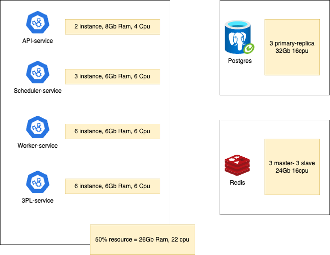
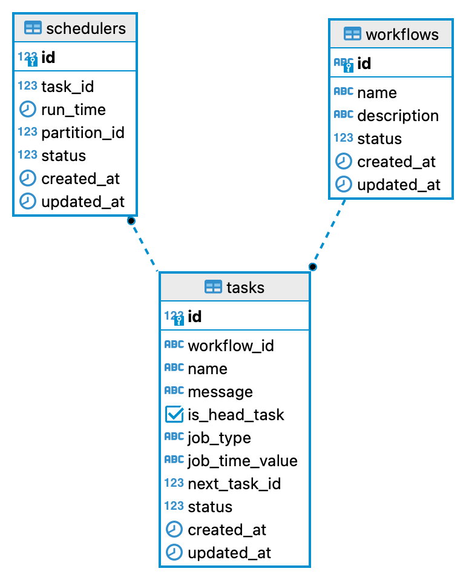
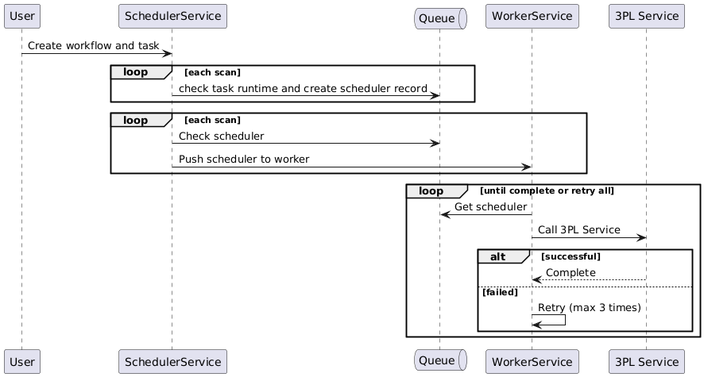
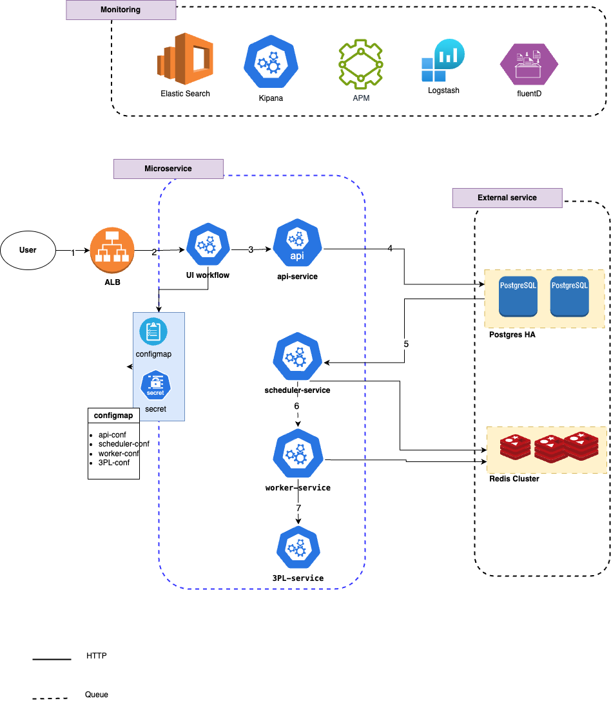

# Workflow Engine

This is the readme for the workflow engine including design, concepts and implementation.


## Testing ENV

- join [link test notify](https://web.telegram.org/k/#-4266372848)
- service ip: 103.82.38.155:8088
- check [postman_collection.json](workflow.postman_collection.json) and import to postman

# Health Check
``` http://localhost:8088/v1/health ```

# Design Time Delay system

## Function Requirements
- Feature called the Time delay. It allows users to specify exactly how long the system should wait before moving to the next step, i.e. run the scheduled actions, in their workflow. We support specifying timing in the following ways:
* A certain period of time. It means waiting for X minutes, hours, or days before doing the job.
* A certain day of the week. For example, if the user selects Monday and Wednesday, but the current day is Tuesday, the system will delay the job until Wednesday because it is the first available day of the week match.
* A specific day of year. The system will wait until the date matches the user’s inputted date.

## Non-Functional Requirements
- there can be millions of new/due timers every hour
- Reliability. Timers must be recovered if the system fails or restarts. It should guarantee at-least-once delivery of every single job.
- Scalability. The scheduling system should be horizontally scalable, to be able to handle ~5M new/due timers per hour at peak. 
- Timing accuracy. In the workflow system, it is required that jobs run within seconds of their scheduled time. The scheduler should have a p95 scheduling deviation below 10 seconds.
- Flexibility. The user is able to change value or cancel timers on the fly. 
- The system’s capacity should cover 5M new timers and 5M due timers per hour. The traffic can be doubled anywhen in near future.


## Resources estimates
The system’s capacity should cover 5M new timers and 5M due timers per hour. The traffic can be doubled anywhen in near future.

- 5M requests per hour -> 1389 requests per seconds
- a worker has resources 1core (1000m), 1Gb Ram
- average a request takes 100ms, 1 worker can handle 20 to 30 ccu -> 250 requests per worker
- need 6 workers -> 3 scheduler (3 partition)
- 1389 requests per seconds -> 1389*10 read/write per second -> ~ postgres need cpu 13.9 core, 32 or 64Gb RAM
- 10kb for a task -> 10*1389*60*60*24 -> 1.2 TB per day -> 438TB per year

=> 

## Database design



## Interface design

#### User:

- Create Workflow: User creates a new workflow.
- Create Task: User adds tasks to the workflow, each task will have necessary information such as name, execution time, and other parameters.

#### Schedule Service:

- Scan Task: Scheduler Service periodically scans the list of tasks.
- Create Scheduler Record: Based on the task information, Scheduler Service creates a scheduler record to manage the execution schedule.
- Create Scheduler: When it is time to execute, Scheduler Service will push the scheduler record to a queue for Worker Service to process.

#### Worker Service:

- Get Scheduler: Worker Service gets the scheduler record from the queue.
- Process Scheduler: Worker Service performs task processing logic, including calling the corresponding API service.
- Call 3PL Service: If necessary, Worker Service will call 3PL Service to complete the job.
- Retry: If the processing fails, Worker Service will retry up to 3 times.
#### 3PL Service:

- Performance of work: 3PL Service receives requests from Worker Service and performs the requested work.

### Note:
- Queue: Using queues to communicate between Scheduler Service and Worker Service helps ensure decoupling and scalability.

- Retry Mechanism: Retry mechanism helps increase system reliability, especially in case of transient errors.

- Error Handling: There should be a detailed error handling mechanism to log, send notifications, and prevent errors from spreading.

- Monitoring: There should be a monitoring system to track the performance of services and detect potential problems.

## High Level Design



```
@startuml
participant User
participant SchedulerService
queue Queue
participant WorkerService
participant "3PL Service" as 3PL

User -> SchedulerService: Create workflow and task
loop each scan
SchedulerService -> Queue: check task runtime and create scheduler record
end
loop each scan
SchedulerService -> Queue: Check scheduler
SchedulerService -> WorkerService: Push scheduler to worker
end

loop until complete or retry all
WorkerService -> Queue: Get scheduler
WorkerService -> 3PL: Call 3PL Service
alt successful
3PL --> WorkerService: Complete
else failed
WorkerService -> WorkerService: Retry (max 3 times)
end
end
@enduml
```

## Scale Design



### Explanation:
```
* User: The starting point of the process, the user interacts with the system through the user interface.
* ALB (Application Load Balancer): A load balancer, distributing traffic to different microservices in the system.
* UI workflow: User interface, where users perform tasks and interact with the system.
* api-service: Service that provides APIs (application programming interfaces) for other components to interact with each other.
* scheduler-service: Scheduler service, responsible for scheduling and managing jobs to be performed.
* worker-service: Service that executes jobs scheduled by the scheduler-service.
* 3PL-service: Third-party service, providing additional functionality to the system.
* Postgres HA: Relational database, designed to ensure high availability.
* Redis Cluster: NoSQL database, often used to store cache data, sessions, and configurations.
* ConfigMap and Secret: Used in Kubernetes to store configurations and sensitive information of services.
* Monitoring: The monitoring system includes tools such as ElasticSearch, Kibana, APM, Logstash and Fluentd to track and analyze system performance.
```

## Flow User Test:
```
1. The user interacts with the workflow UI.
=> 2. The workflow UI sends requests to the api-service via the ALB.
=> 3. The api-service processes the requests and may call other services such as the scheduler-service to schedule jobs or the 3PL-service to perform additional functions.
=> 4. The scheduler-service stores the schedule in a Postgres database and uses Redis to manage pending jobs.
=> 5. The worker-service continuously checks the queue in Redis and executes the scheduled jobs.
=> 6. The 3PL-service executes the jobs assigned by the worker-service.
=> 7. The monitoring system collects data from various components and displays it on Kibana to help administrators monitor and troubleshoot issues.
```

## Deployment

- use k8s for deploy, manage, config and scale services

- [api deployment](manifest/api-service.yaml)
- [scheduler deployment](manifest/scheduler-service.yaml)
- [worker deployment](manifest/worker-service.yaml)

## Run development 
1. use go runtime
- go run cmd/main.go

2. use docker
- modify [.env](.env) file
- docker build -t workflow .
- docker run -d -p 8088:8088 workflow or docker run -d -p 8088:8088 --name workflow registry.gitlab.com/huylqbk/workflow:latest 

## Testing
```
go test -v ./...
```
## Load test
- use k6 for loadtest
- [k6 loadtest](loadtest/script.js)
- Run: k6 run loadtest/script.js

## Monitor
- The monitoring system includes tools such as ElasticSearch, Kibana, APM, Logstash and Fluentd to track and analyze system performance.

- APM Server: http://103.82.38.155:5601/app/apm/services/workflow/overview?kuery=&rangeFrom=now-16h&rangeTo=now&environment=dev&comparisonEnabled=true&comparisonType=day


